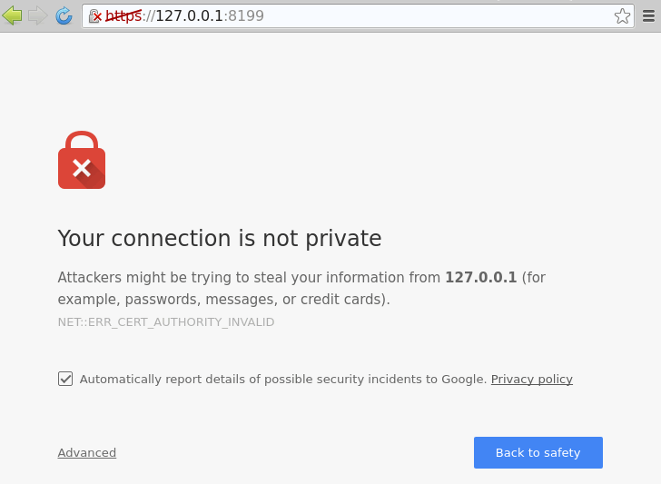
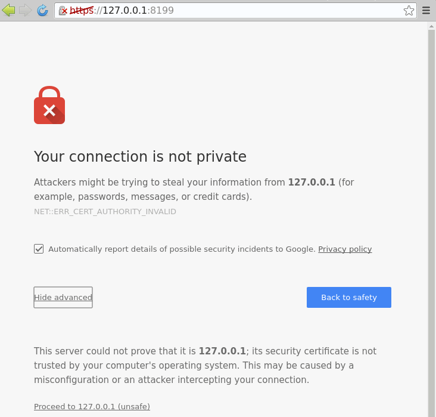

[TOC]

>[danger] # HTTPS服务

建立HTTPS服务非常简单，使用框架Web Server提供的```EnableHTTPS(certFile, keyFile string) error```方法即可。很显然，该方法中需要提供两个参数，即两个用于HTTPS非对称加密的证书文件以及对应的秘钥文件。


>[success] ## 准备工作

在本地演示的需要，我们可以使用```openssl```命令生成本地用于测试的证书和对应的秘钥文件。命令如下：

1. 使用常用的RSA算法生成秘钥文件
    ```shell
    openssl genrsa -out server.key 2048
    ```
    此外，我们也可以使用ECDSA算法来生成秘钥文件：
    ```shell
    openssl ecparam -genkey -name secp384r1 -out server.key
    ```
1. 根据秘钥文件生成证书文件
	```shell
    openssl req -new -x509 -key server.key -out server.crt -days 365
    ```
1. (可选)根据秘钥生成公钥文件，该文件用于客户端与服务端通信
	```shell
    openssl rsa -in server.key -out server.key.public
    ```
```openssl```支持的算法以及命令参数比较多，如果想要深入了解请使用```man openssl```命令进行查看。本次示例中，本地环境(Ubuntu)使用命令生成相关秘钥、公钥、证书文件的流程如下：

```shell
john@johnhome:~/https$ openssl genrsa -out server.key 2048
Generating RSA private key, 2048 bit long modulus
.........................+++
.....................................................................+++
unable to write 'random state'
e is 65537 (0x10001)

john@johnhome:~/https$ openssl req -new -x509 -key server.key -out server.crt -days 365
You are about to be asked to enter information that will be incorporated
into your certificate request.
What you are about to enter is what is called a Distinguished Name or a DN.
There are quite a few fields but you can leave some blank
For some fields there will be a default value,
If you enter '.', the field will be left blank.
-----
Country Name (2 letter code) [AU]:CH
State or Province Name (full name) [Some-State]:SiChuan            
Locality Name (eg, city) []:Chengdu
Organization Name (eg, company) [Internet Widgits Pty Ltd]:John.cn
Organizational Unit Name (eg, section) []:Dev
Common Name (e.g. server FQDN or YOUR name) []:John
Email Address []:john@johng.cn

john@johnhome:~/https$ openssl rsa -in server.key -out server.key.public
writing RSA key

john@johnhome:~/https$ ll
total 20
drwxrwxr-x  2 john john 4096 Apr 23 21:26 ./
drwxr-xr-x 90 john john 4096 Apr 23 20:55 ../
-rw-rw-r--  1 john john 1383 Apr 23 21:26 server.crt
-rw-rw-r--  1 john john 1675 Apr 23 21:25 server.key
-rw-rw-r--  1 john john 1675 Apr 23 21:26 server.key.public
```
其中，生成证书的命令提示需要录入一些信息，可以直接回车留空即可，我们这里随便填写了一些。


>[success] ## 示例代码

根据以上生成的秘钥和证书文件，我们来演示如果使用ghttp.Server实现一个HTTPS服务。示例代码如下：
```go
package main

import (
    "gitee.com/johng/gf/g/net/ghttp"
)

func main() {
    s := ghttp.GetServer()
    s.BindHandler("/", func(r *ghttp.Request){
        r.Response.Writeln("来自于HTTPS的：哈喽世界！")
    })
    s.EnableHTTPS("/home/john/https/server.crt", "/home/john/https/server.key")
    s.SetPort(8199)
    s.Run()
}
```

可以看到，我们直接将之前生成的证书和秘钥文件地址传递给```EnableHTTPS```即可，通过```s.SetPort(8199)```设置HTTPS的服务端口，当然我们也可以通过```s.SetHTTPSPort(8199)```来实现，在单一服务下两者没有区别，当Web Server需要同时支持HTTP和HTTPS服务的时候，两者的作用就不同了，这个特性我们会在后面介绍。随后我们访问页面```https://127.0.0.1:8199/```来看一下效果：

可以看到浏览器有提示信息，主要是因为我们生成的证书为私有的，非第三方授信企业提供的。浏览器大多会自带一些第三方授信的HTTPS证书机构，这些机构提供的HTTPS证书被浏览器认为是权威的、可信的，才不会出现该提示信息。一般这种第三方权威机构授信证书价格在几千到几十万人民币不等 - **每年**，感兴趣的朋友可在搜索引擎上了解下。


我们这里直接点击“Advanced”,然后点击“Proceed to 127.0.0.1 (unsafe)”，最终可以看到页面输出预期的结果：


>[danger] # HTTPS与HTTP支持


