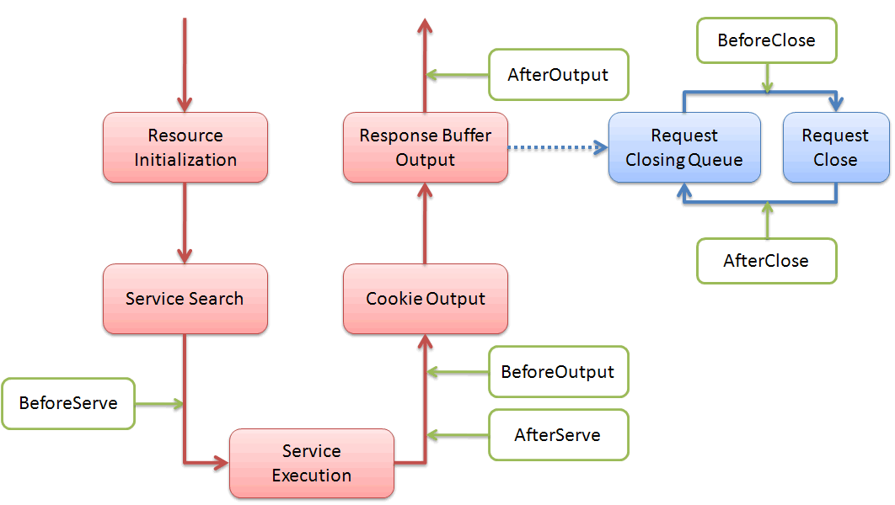

>[danger] # 事件回调注册



```ghttp.Server```提供了事件回调注册功能，类似于其他框架所谓的```中间件```功能，支持用户对于某一事件进行自定义监听处理，按照```pattern```方式进行绑定注册(```pattern```格式与服务注册一致)。支持多个方法对同一事件进行监听，```ghttp.Server```将会按照注册顺序进行回调方法调用。
相关方法如下：
```go
func (s *Server) BindHookHandler(pattern string, hook string, handler HandlerFunc) error
func (s *Server) BindHookHandlerByMap(pattern string, hookmap map[string]HandlerFunc) error
```
当然域名对象也支持事件回调注册：
```go
func (d *Domain) BindHookHandler(pattern string, hook string, handler HandlerFunc) error
func (d *Domain) BindHookHandlerByMap(pattern string, hookmap map[string]HandlerFunc) error
```
支持的Hook事件列表：
1. ```BeforeServe```
	在进入/初始化服务对象之前。
1. ```AfterServe```
	在完成服务执行流程之后。
1. ```BeforeOutput```
	向客户端输出返回内容之前。
1. ```AfterOutput```
	向客户端输出返回内容之后。
1. ```BeforeClose```
	在http请求关闭之前（注意请求关闭是异步处理操作，没有在http执行流程中处理）。
1. ```AfterClose```
	在http请求关闭之后（注意请求关闭是异步处理操作，没有在http执行流程中处理）。

具体调用时机请参考图例所示。

## 使用示例1，基本使用
```go
package main

import (
    "gitee.com/johng/gf/g"
    "gitee.com/johng/gf/g/os/glog"
    "gitee.com/johng/gf/g/net/ghttp"
)

func main() {
    // 基本事件回调使用
    p := "/:name/info/{uid}"
    s := g.Server()
    s.BindHookHandlerByMap(p, map[string]ghttp.HandlerFunc{
        "BeforeServe"  : func(r *ghttp.Request){ glog.Println("BeforeServe") },
        "AfterServe"   : func(r *ghttp.Request){ glog.Println("AfterServe") },
        "BeforeOutput" : func(r *ghttp.Request){ glog.Println("BeforeOutput") },
        "AfterOutput"  : func(r *ghttp.Request){ glog.Println("AfterOutput") },
        "BeforeClose"  : func(r *ghttp.Request){ glog.Println("BeforeClose") },
        "AfterClose"   : func(r *ghttp.Request){ glog.Println("AfterClose") },
    })
    s.BindHandler(p, func(r *ghttp.Request) {
       r.Response.Write("用户:", r.Get("name"), ", uid:", r.Get("uid"))
    })
    s.SetPort(8199)
    s.Run()
}
```
当访问```http://127.0.0.1:8199/john/info/10000```时，运行Web Server进程的终端将会按照事件的执行流程打印出对应的事件名称。

## 使用示例2，改变业务逻辑
```go
package main

import (
    "fmt"
    "gitee.com/johng/gf/g"
    "gitee.com/johng/gf/g/net/ghttp"
)

func main() {
    s := g.Server()

    // 多事件回调示例，事件1
    pattern1 := "/:name/info"
    s.BindHookHandlerByMap(pattern1, map[string]ghttp.HandlerFunc {
        "BeforeServe"  : func(r *ghttp.Request) {
            r.SetQuery("uid", "1000")
        },
    })
    s.BindHandler(pattern1, func(r *ghttp.Request) {
        r.Response.Write("用户:", r.Get("name"), ", uid:", r.GetQueryString("uid"))
    })

    // 多事件回调示例，事件2
    pattern2 := "/{object}/list/{page}.java"
    s.BindHookHandlerByMap(pattern2, map[string]ghttp.HandlerFunc {
        "BeforeOutput" : func(r *ghttp.Request){
            r.Response.SetBuffer([]byte(
                fmt.Sprintf("通过事件修改输出内容, object:%s, page:%s", r.Get("object"), r.GetRouterString("page"))),
            )
        },
    })
    s.BindHandler(pattern2, func(r *ghttp.Request) {
        r.Response.Write(r.Router.Uri)
    })
    s.SetPort(8199)
    s.Run()
}
```

通过事件1设置了访问```/:name/info```路由规则时的GET参数；通过事件2，改变了当访问的路径匹配路由```/{object}/list/{page}.java```时的输出结果。

## 使用示例3，使用事件回调处理跨域请求
```go
package main

import (
    "gitee.com/johng/gf/g"
    "gitee.com/johng/gf/g/frame/gmvc"
    "gitee.com/johng/gf/g/net/ghttp"
)

type Order struct {
    gmvc.Controller
}

func (o *Order) Get() {
    o.Response.Write("GET")
}

func main() {
    s := g.Server()
    s.BindControllerRest("/api.v1/{.struct}", new(Order))
    s.SetPort(8199)
    s.Run()
}
```
```go
package main

import (
    "gitee.com/johng/gf/g"
    "gitee.com/johng/gf/g/frame/gmvc"
    "gitee.com/johng/gf/g/net/ghttp"
)

type Order struct {
    gmvc.Controller
}

func (o *Order) Get() {
    o.Response.Write("GET")
}

func main() {
    s := g.Server()
    s.BindHookHandlerByMap("/api.v1/*any", map[string]ghttp.HandlerFunc {
       "BeforeServe"  : func(r *ghttp.Request) {
           r.Response.SetAllowCrossDomainRequest("*", "PUT,GET,POST,DELETE,OPTIONS")
       },
    })
    s.BindControllerRest("/api.v1/{.struct}", new(Order))
    s.SetPort(8199)
    s.Run()
}
```