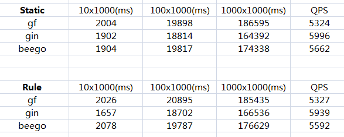

本章节主要针对```gf/gin/beego```三款框架进行性能测试比较，分别测试并发数在10/100/1000的情况下(每个并发的请求量为1000)，以及在静态/动态路由条件下，三款框架的处理时间，最终以QPS的结果作为衡量指标。需要注意的是，测试代码不包含任何复杂的业务逻辑，因此只有一句简单的```哈喽世界！```。

## 测试环境
CPU：AMD A8-6600K
内存：16GB
系统：Ubuntu Desktop 14.04 x64
软件：
1. **gf** - v0.98 beta
2. **gin** - v1.2
3. **beego** - v1.9.2

代码：[gitee.com/johng/gf/tree/master/geg/net/ghttp/performance](https://gitee.com/johng/gf/tree/master/geg/net/ghttp/performance)


## 测试结果



## 总结说明

1. 三款框架在静态及动态路由条件下的各自的性能相差不大；
2. ```gin```的性能最高，其次是```beego```，其次是```gf```，但三者总体性能差异不大；
3. ```gf```的底层对http server做了许多封装，因此在性能上有一定的损耗，但是带来了更高的灵活性和易用性，平衡了框架各个方面的性价比；
4. 开源软件质量参考衡量指标：
	* 简洁易用
	* 文档丰富
	* 性能高效
	* 社区活跃
	* 维护频繁